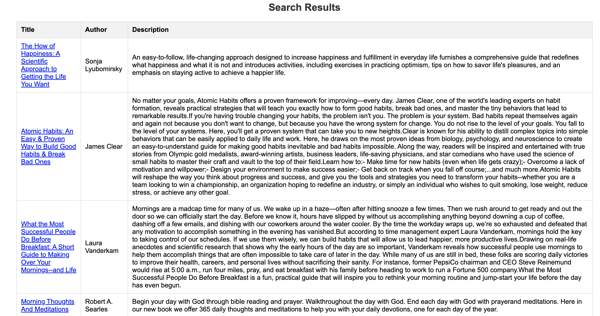
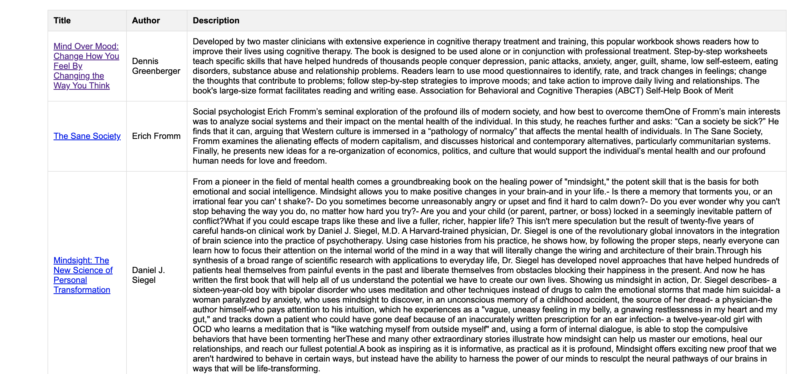
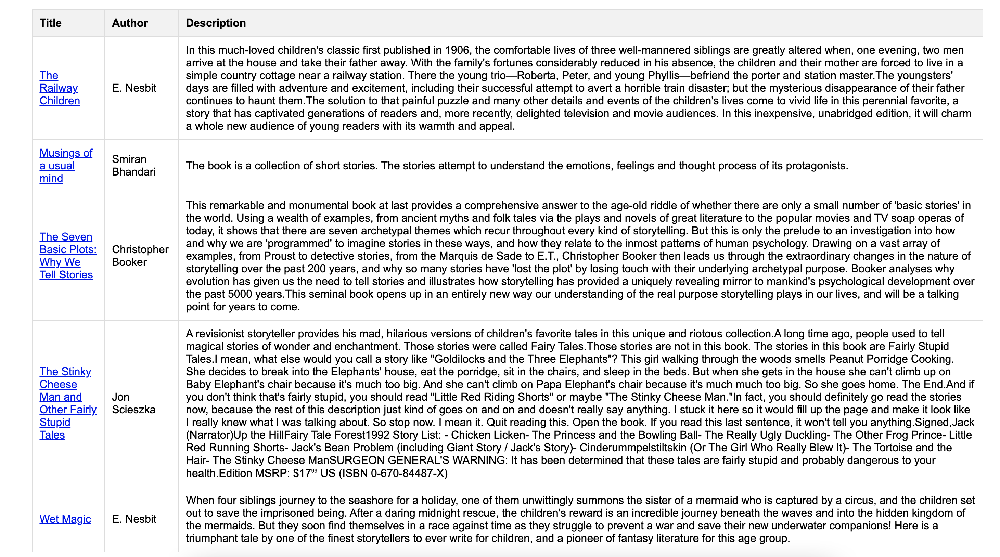

# book-recommender

<!--  -->


This is an web app that makes use of sentence embeddings to be able to find appropriate books, based on the given desired description.

Given a desired book description desire e.g. "An adventure book with plotwist" the app finds the most appropriate books based on their description.

The book collection used was found in [kaggle](https://www.kaggle.com/datasets/ishikajohari/best-books-10k-multi-genre-data). They are still stored in this repo for convenience.
The app computes beforehand the sentence embeddings for all books using their description. Then for every new request the embedding based on the given query is computed and then computes the cosine similarity to measure the distance between the given query and any book description.

The framework to setup the app is Fastapi.

## Usage

Computing the embeddings takes too long (~4 minutes on my machine) and for this reason we store them on a local postgres instance, after they are computed for the first time. To create a local postgres instance you can use docker and concretely the commands:

```bash
docker pull postgres
docker run -d -p 5432:5432 -e POSTGRES_PASSWORD=password --name postgres-instance postgres:latest
```

After you must create  a `.env` file to include all the required credentials and ensure that the postgres user has proper access rights:

```bash
# contents of .env file
DB_HOST='<>'
DB_PORT='<>'
DB_USER='<>'
DB_PASSWORD='<>'
DB_NAME='<>'
```

Before running the webapp, to populate the books in the database, you can start the app by:

```bash
poetry install
export $(grep -v '^#' .env | xargs)
poetry run python -m book_recommender
```

and then to start the web app:

```bash
poetry run uvicorn app.main:app --reload
```

## Examples

Here I show some examples for the results that one receives for some queries

- something that can help me improve my day to day life



- mental health



- a story that adults and children could also enjoy


